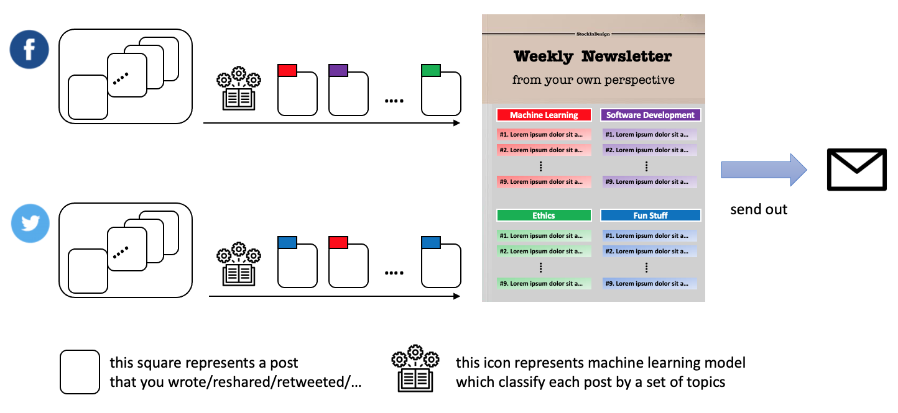
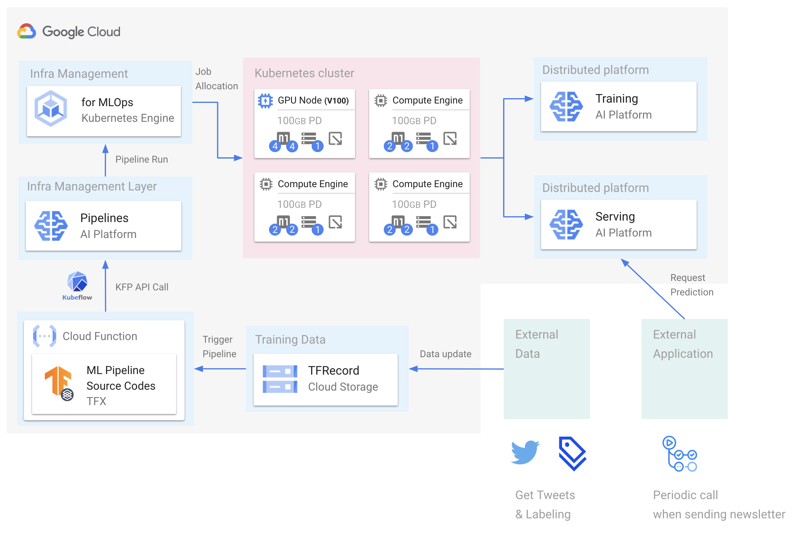

# Curated Personal Newsletter

## Motivation
Today people use social networking platforms such as Facebook, Twitter, etc. to understand what’s happening in the field of their interest. They do this by following influencers' accounts or hitting a share/retweet button. It is good for them to keep all the interesting information on their walls.

However, the problem arises when they click the share/retweet button too many times. They will end up with a pile of information all around, and they might not even remember what each piece of information is about.

## How this project can help?
The end product of this project collects all the posts from one's SNS wall (including personal note/shared/retweeted), then it will send a automatically curated periodic newsletter. 

The curation is a simple process. It will go through each post and classify them by their topics. In this way, all the massy pile of information coulde be organized in a meaningful way to be consumed more easily.

## Architecture
This project is designed to show how to build End-to-End Machine Learning pipeline on Google Cloud Platform. 

Below shows the products consisting of the whole pipeline and their roles in this project.
- **Cloud Scheduler**
  - There are two periodic works. One for collecting new data for updating the deployed/trained latest model. The other one is for publishing a newsletter. It collects data from SNS and push the data to go through the data validation/transformation pipeline. When the data is ready, it will be fed into the existing model to get predictions. Based on the returned prediction, newsletter will be constructed and published.
- **BigQuery**
  - This is mainly for storing historical data that has been collected periodically.
- **Dataflow**
  - Dataflow is used for Data Extraction/Validation, Data Transformation, and Model Evaluation purposes. 
- **Cloud Storage**
  - There are a bunch of intermediate results from Data Extraction/Validation, Data Transformation, Model Training, and Model Analysis. Those intermediate results are stored in Cloud Storage service.
- **AI Platform**
  - AI Platform is used for training and serving a model. The newly trained model is stored in Cloud Storage service.

## Todo
- [ ] Collect & Label text data from Twitter / Facebook
- [ ] Train & Evaludate an intial model 
- [ ] Build a pipeline shown in the Archtecture
- [ ] Testing
