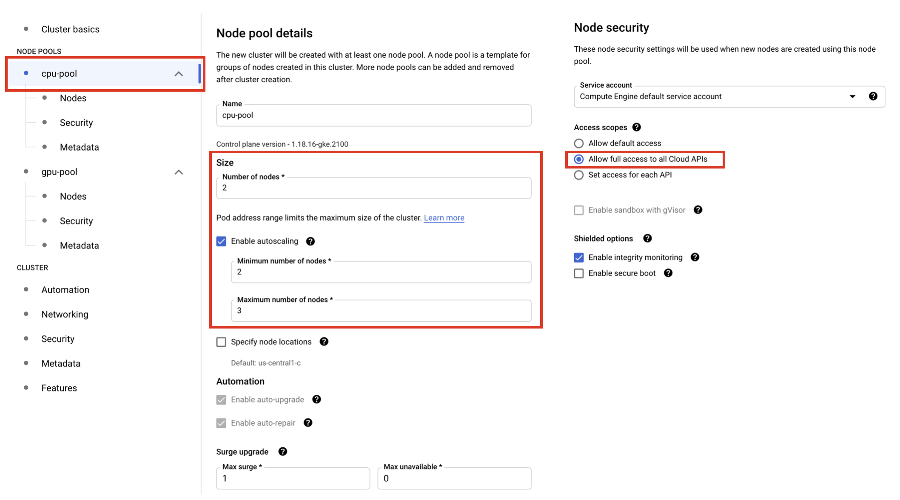
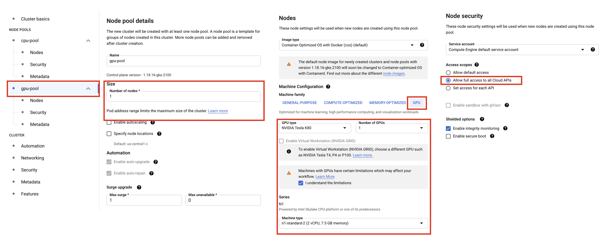
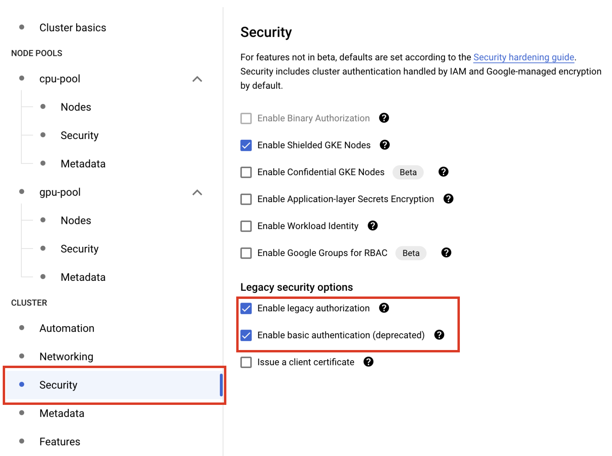
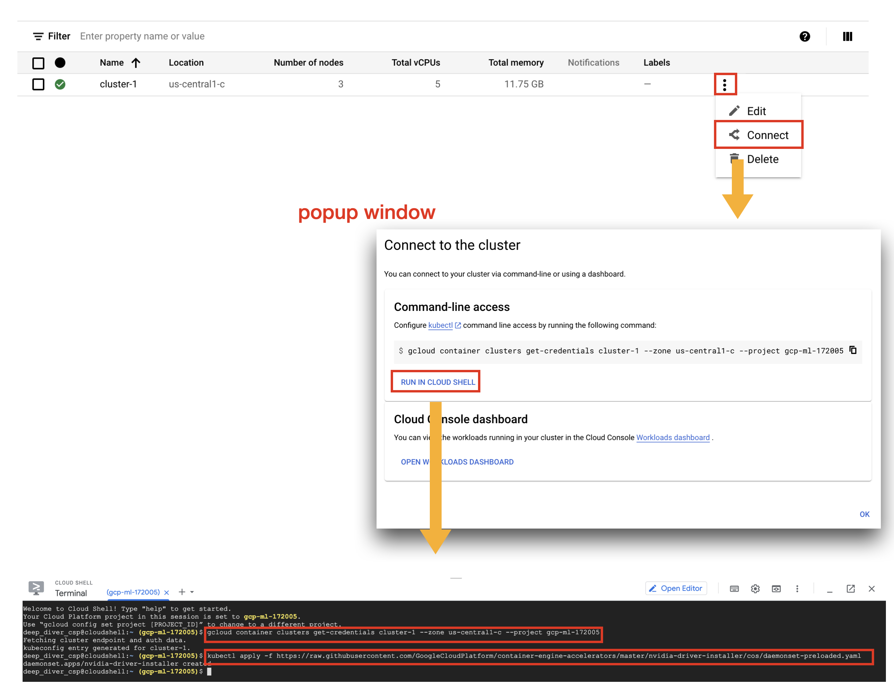
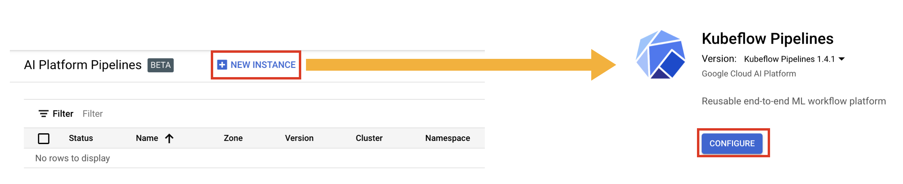
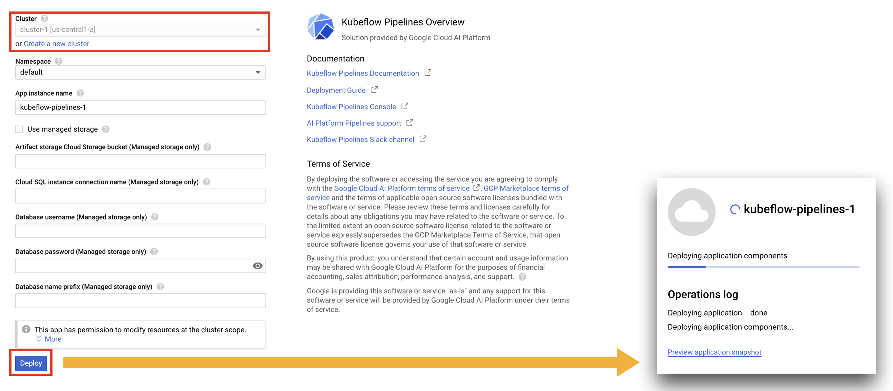
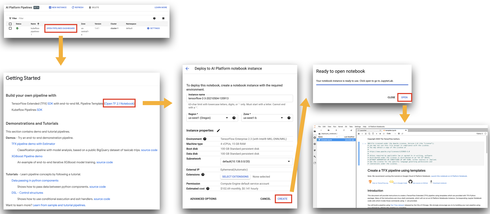
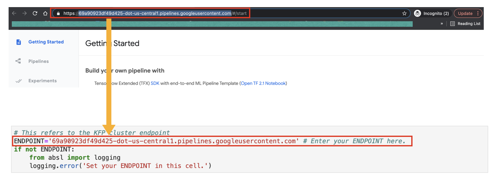
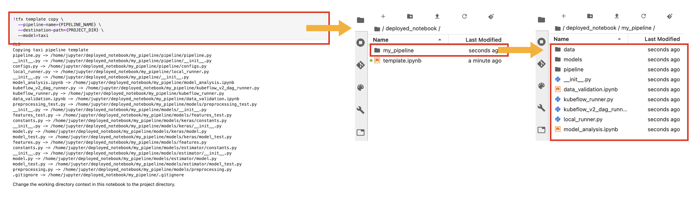
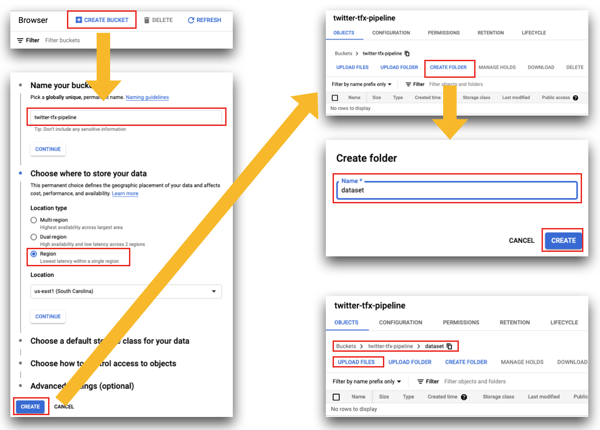

# Steps to follow to replicate this project.

## 1. Collect data from twitter
The first step is about collecting data.

- [ ] You need twitter API keys issued from [Twitter's Developer Portal](https://developer.twitter.com/en) and [Tweepy](https://www.tweepy.org/) which is a open source project to scrap tweets in OOP manner.
- [ ] You need to scrap tweets using [scrap_tweets.py](https://github.com/deep-diver/personal_newsletter_curation/blob/main/utils/scrap_tweets.py). It is a base source code to collect tweets via Tweepy and save them in CSV file format. In the CSV file, only the text are stored.
- [ ] Next step is to label the collected data via your favoriate Text Classification Annotation Tool. In my case, I have used [docanno](https://github.com/doccano/doccano) which is a free open source tool.
- [ ] The final step is to convert the labeled dataset(CSV) to TFRecord format file. You can use [convert_to_tfrecord.py](https://github.com/deep-diver/personal_newsletter_curation/blob/main/utils/convert_to_tfrecord.py) for this purpose. It simply converts raw text and labels into protocol buffer compatible data types and save them in TFRecord format file.

## 2. Create a GCP AI Platform Pipeline
The second step is to build a machine learning pipeline via Google Cloud Platform.

- [ ] Before directly creating a GCP AI Platform Pipeline, you first need to spin up Kubernetes Cluster on  Google Kubernetes Engine(GKE). One thing to note is that you should include a GPU node pool with **one** GPU node configured. 
- [ ] CPU node pool can be configured as you like. In my case, I have setup with a default type of VM with 2 nodes in it. The only thing to be careful is that you should check `Allow full access to all Cloud APIs` option under `NODE POOLS > CPU NODE POOL > Security` tab.



- [ ] You should click `Add Node Pool` button to add additional node pool for GPU. GPU node pool is configures like below. The only thing to be careful(just like CPU node pool) is that you should check `Allow full access to all Cloud APIs` option under `NODE POOLS > GPU NODE POOL > Security` tab.



- [ ] One last thing to configure before spinning up the GKE cluster is the options, `Enable legacy authorization` and `Enable basic authentication(deprecated)` under `CLUSTER > Security` tab



- [ ] After spinning up the GKE Cluster successfully, you should install the NVIDIA GPU device drivers. [This guide](https://cloud.google.com/kubernetes-engine/docs/how-to/gpus#installing_drivers) explains how in more detail. In order to breifly give a how-to, you first connect to the GKE cluster via Cloud Shell. Then just run the `kubectl apply -f https://raw.githubusercontent.com/GoogleCloudPlatform/container-engine-accelerators/master/nvidia-driver-installer/cos/daemonset-preloaded.yaml` CLI in the shell.



- Now we are ready to create a GCP AI Platform Pipeline. Actually, it is possible to create a GKE cluster on the go, but only the default configuration can be provided. In order to enable GPU node pool, the above steps are required. (*The reason why we need a GPU node pool is that BERT based model is too huge to be even evaluated with CPUs*). 

- [ ] Simply click the `NEW INSTANCE` button on AI Platform Pipeline service, then it will bring you to the new page. Then clicke the `CONFIGURE` button on that new page.



- [ ] A new page called `Kubeflow Pipelines Overview` will be loaded. This is the page you can configure your pipeline. Just make sure the GKE cluster that we have just created is selected under `Cluster` menu. Then simply hit the `Deploy` button on the bottom. It will take few minutes to complete the pipeline creation step. 



## 3. Run TFX Pipeline

- [ ] The initial TFX Pipeline can be setup through AI Platform Notebook. In order to setup a notebook, open up the pipeline dashboard by clicking `OPEN PIPELINES DASHBOARD` button. When the dashboard page pops up, find `Open TF 2.1 Notebook` link. It says `TF 2.1`, but it supports further versions too. When clicking that link, it will bring you to a page for setting up a AI Platform Notebook instance. With the default setting, please click `CREATE` button at the bottom. It will take a couple of minutes to finish setting it up. On the popped up window(Ready to open notebook), you can click `OPEN` button, then it will redirect you to the JupyterLab page.



- [ ] Please run the cells on the `template.ipynb` notebook sequentially until you encounter a cell containing `ENDPOINT` variable to setup. You have to setup the `AI Platform Pipeline's Endpoint URL`, and you can find the URL easily by looking up the URL text box on the pipeline dashboard page. After setting `ENDPOINT` with an appropriate value, then hit run the cell. 



- You are all set up for interacting with AI Platform Pipeline via AI Platform Notebook. The only thing left is to run the actual `TFX` code. The JupyterLab doesn't have any files or folders, so lets create them first.

- [ ] Please run the cells on the `template.ipynb` notebook sequentially from where you stopped until you encounter a cell containing `TFX CLI` which is `!tfx template copy ...`. When you run that cell, it will create template directories for you. The name of root directory is `my_pipeline`. If you navigate the subdirectories, you will see the directory tree structures like below.



- [ ] The auto generated TFX Template is not about NLP. You need to replace the base code with appropriate pre-processing and modeling codes. In my case, I have just borrowed an example code for BERT written by Hannes Hapke. You can find the example notebook [here](https://github.com/tensorflow/workshops/blob/master/blog/TFX_Pipeline_for_Bert_Preprocessing.ipynb). However, the replaced version of the code base is already provided in this repo. Please refer to [this directory](https://github.com/deep-diver/personal_newsletter_curation/tree/main/pipeline/imdb_pipeline), and put it on your server.

- Once you have fully cumtomized code base for NLP task, then it is time to run the TFX. In order to run the TFX pipeline, we need data. So please upload the TFRecord file from the step where you collected tweets via twitter API. The data should be uploaded in GCS bucket. 

- [ ] Go to Cloud Storage service on GCP console. Then Click the `CREATE BUCKET` button to create a new bucket. Name the bucket name to `twitter-tfx-pipeline-(your initial)`. Just make sure your bucket name is globally unique. 

- [ ] When a new bucket is created, make a folder named `dataset`, and place the `TFRecord` in `dataset` folder by clicing `UPLOAD FILES` button.



- [ ] Having the `TFRecord` in GCS, you need to reflect the changes of the location in the project's source code as well. There are two files to modify. One is `mypipeline/pipeline/configs.py`, and the other one is `mypipeline/kubeflow_runner.py`.

```python
# mypipeline/pipeline/configs.py
GCS_BUCKET_NAME = #YOUR GCS PATH for the bucket

# mypipeline/kubeflow_runner.py
DATA_PATH = #YOUR GCS PATH for the dataset
```

- [ ] One last thing to run TFX Pipeline is to configure `KubeflowDagRunnerConfig` in order to let the running containers are seeking GPU node (or with some constraints). This step is necessary because your training/evaluation will take forever if you don't use GPU. The default settings are specified in `mypipeline/kubeflow_runner.py`, so you need to replace the default with the below.

```diff
+ def request_gpu():
+   def _set_gpu(container_op):
+     container_op.set_gpu_limit(1)
+   return _set_gpu

+ pipeline_op_funcs = kubeflow_dag_runner.get_default_pipeline_operator_funcs()
+ pipeline_op_funcs.append(request_gpu())

runner_config = kubeflow_dag_runner.KubeflowDagRunnerConfig(
+   pipeline_operator_funcs=pipeline_op_funcs, 
    kubeflow_metadata_config=metadata_config, tfx_image=tfx_image)
pod_labels = kubeflow_dag_runner.get_default_pod_labels()
pod_labels.update({telemetry_utils.LABEL_KFP_SDK_ENV: 'tfx-template'})
kubeflow_dag_runner.KubeflowDagRunner(
    config=runner_config, pod_labels_to_attach=pod_labels
).run(...
```

- [ ] Change the TFX docker image version for GPU support. Default TFX image version from the template is `0.26.0`, but this version doesn't support `tensorflow-gpu` and appropriate CUDA version by default. From `0.28.0`, GPU is officially supported, so we need to change accordingly. Go to the `Dockerfile` under `pipeline/`, then change the file like the below.

```diff
- FROM tensorflow/tfx:0.26.0
+ FROM tensorflow/tfx:0.28.0
WORKDIR /pipeline
COPY ./ ./
ENV PYTHONPATH="/pipeline:${PYTHONPATH}"
```

- [ ] Run TFX Pipeline. Now you are ready to run the TFX pipeline on AI Platform Pipeline. Please run the following cell from the notebook.

```bash
!tfx pipeline create  \
--pipeline-path=kubeflow_runner.py \
--endpoint={ENDPOINT} \
--build-target-image={CUSTOM_TFX_IMAGE}
```

```bash
!tfx run create --pipeline-name={PIPELINE_NAME} --endpoint={ENDPOINT}
```

## 4. Configure TFX Pipeline for AI Platform Training/Serving

- [ ] Uncomment AI Platform Training. TFX pipeline will be executed in a pod under Google Kubernetes Engine by default, and this is not an effective way to run training a model. Your model could be big, so you may need distributed training and more powerful GPUs. Also, GKE is not flexible enough to add/remove GPU Node pools dynamically (you could do it, but it take quiet some time). AI Platform Training is the solution for both of these. Please uncommnet the following lines of code in `kubeflow_runner.py`

```python
ai_platform_training_args=configs.GCP_AI_PLATFORM_TRAINING_ARGS,
```

- [ ] Configure hardware spec for AI Platform Training

- [ ] Uncomment AI Platform Serving

```python
ai_platform_serving_args=configs.GCP_AI_PLATFORM_SERVING_ARGS,
```

## 5. Send out periodidc newsletters via GitHub Action and AI Platform Serving's end point

- [ ] Code for quering predictions to the AI Platform Serving's end point. 

- [ ] Code for periodic execution via GitHub Action.

## 6. Hook up with Cloud Function for noticing the changes in data
